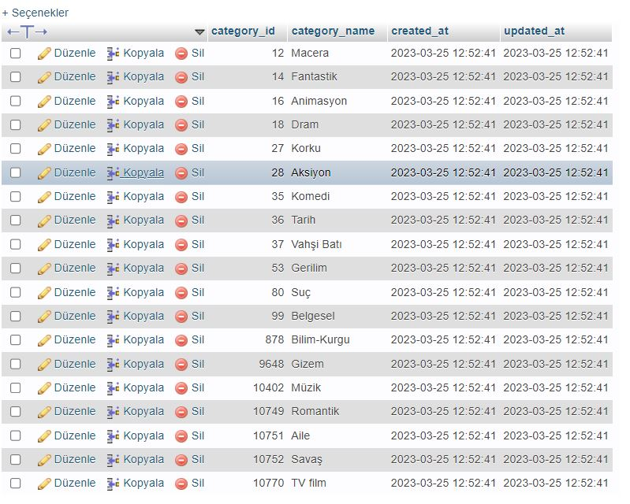

###### V:1.0.2 Geliştirmeler
- Projenin direk public içine ulaşması için .htaccess dosyası ekledim.
- Sidebar css içinde değişiklikler yaptım.
- Projeme sidebarda ve çeşitli yerlerde kullanmak üzere fontawesomeyi (İcon) dahil ettim. 

- Film migration,model ve Controllerını oluşturdum.
- FilmImage migration,model ve Controllerını oluşturdum.
- FilmCategory migration,model ve Controllerını oluşturdum.

- Route yapısı içine gruplama yapdım admin namespace sini tanımladım grup içine yazılan tüm route işlemleri /admin/{id} şeklinde oldu.

- Film, FilmImage ve FilmCategory arasında hasMany hasOne kullanarak bağlantılar oluşturudum.
- Filmleri çekmek için admin/filmcek routunu oluştudum, ve Film controllerda filmleri çekmesi için api ile bağladım.
- Apiden gelen filmler Mysqlde ms_film ve ms_film_image insert edilecek şekilde ayarladım.

- Film (ms_film mysql) :

- Film (ms_film_images mysql) :

- Film (ms_film mysql) :

- Kategorileri çekmek içine admin/kategoricek sayfasını oluşturdum ve FilmKategori Contolleri ile mysql insert işlemi yaptırdım.

- css klasorune pub olarak bir klasör daha ekledim bu kısımdan ön yüz (front end) kodlamaları için scss dosyaları oluşturdum.
- _root.scss sıfırlama ve admin panel ile ortak olan css admin klasöründen dışarı cıkardım ve admin klasörü içinde ve pub içinde çağırdım.

- Projeyi kafamda daha iyi canlandırmak için anasayfaya filmleri çektim.
