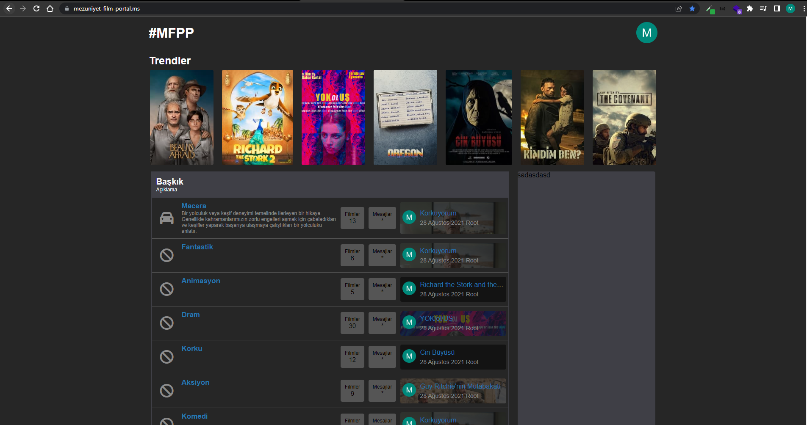
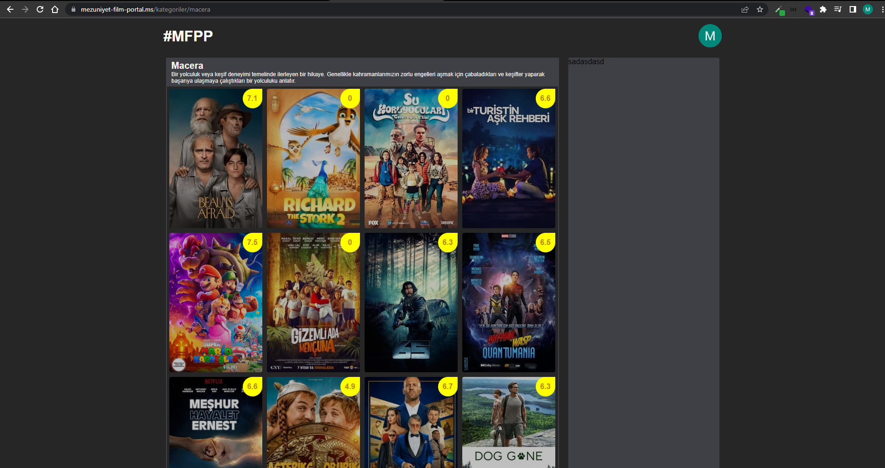

#### V:1.0.4 Geliştirmeler
- SettingsProvider tanımladım sitenin ayarlarını tüm sayfalarda çekilmesi için config içine dizi şeklinde aktardım.
- Kategori sayfasını oluşturdum.
- Film apisini güncelledim otomatik günümüz tarihini ve türkiye bölgesini referans alacak.
- Filmlere url tanımlamak için mysql film tablosuna film_url sütünü ekledim.
- Filmleri apiden çekerken sayfalama olduğu için sayılı veri geliyordu döngü ile sayfa sayisi arttırıldı.
- Anasayfa filmlerin geldiği diziyi iç içe olmak şartı ile 3 e böldüm film,category,count olarak.
- Anasayfa filmlerin geldiği diziyi düzenledim ve count saydırma işlemi yaptım. Her kategori için ekli olan film sayını gösterdim.  
- FilmDeatils controllerını oluşturdum.

###### USER/AUTH
- User (Login/Register..vb) işlemler için Auth Controller klasorunu oluşturdum. 
- Auth Controller altına UserControllerı oluşturdum.
- Auth Modelini oluşturdum ve altına UserModel ekledim.
- Önceden oluşturmuş olduğum ms_user migration çeşitli düzenlemeler yaptım.
- resource/views altına auth klasörünü oluşturdum burdan Login ve Register için ayrı bir layout ile yönetilecek.
- layout login ve register blade'lerini oluşturdum.
 

###### 1.0.4 Sürümden Kareler

