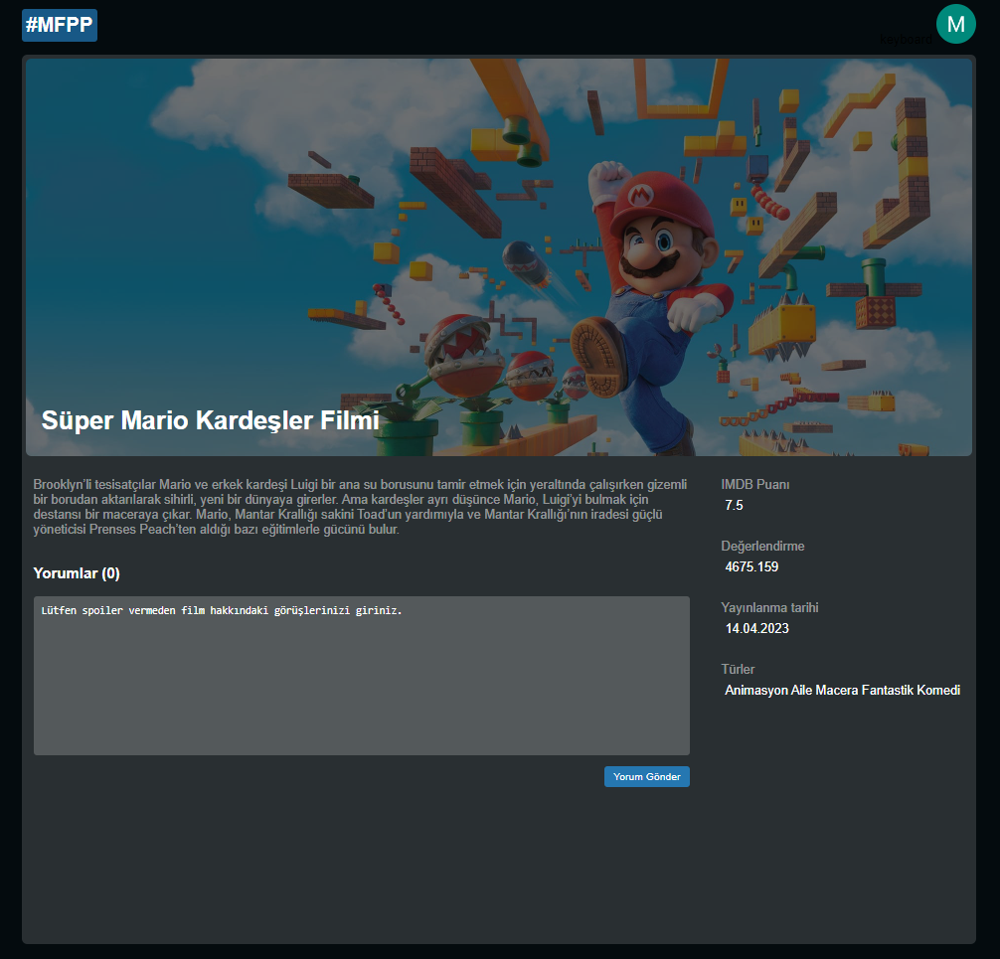
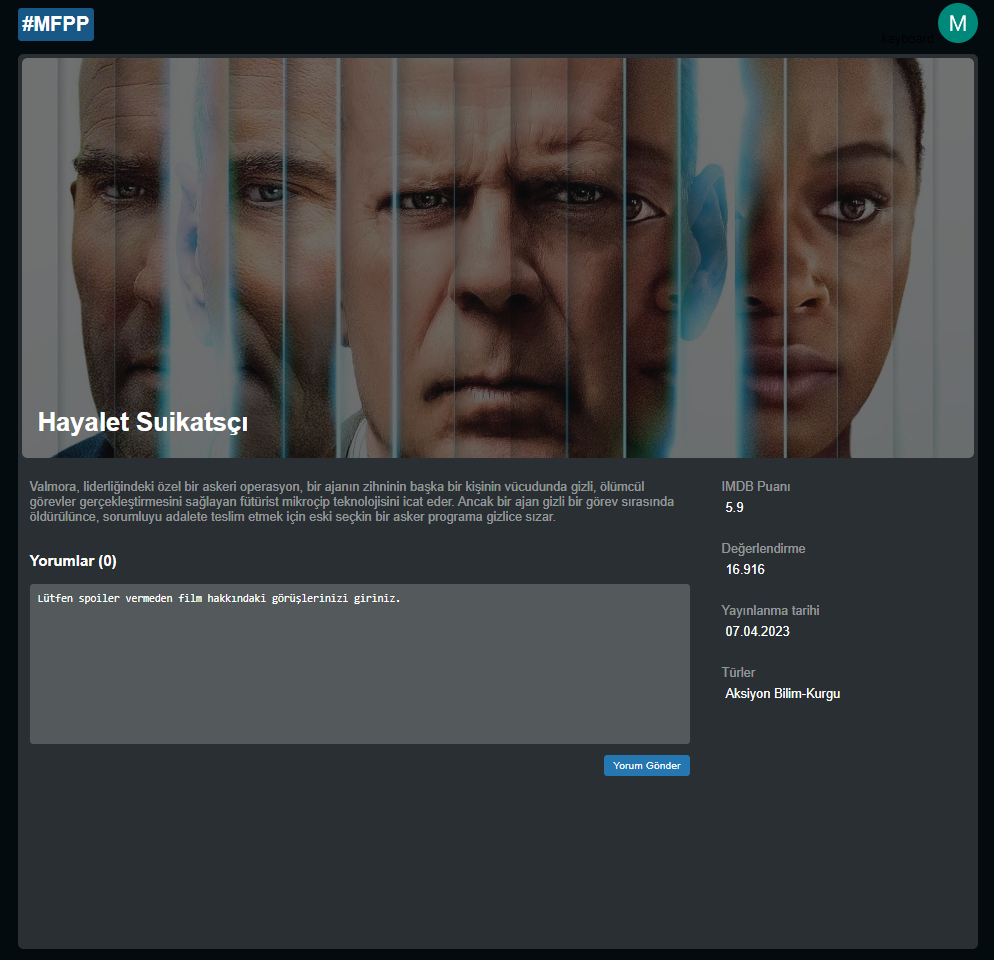

#### V:1.0.5 Geliştirmeler
- Login/Register işlemleri için laravel ui paketini projeye dahil ettim.
- User modelde tablo adı birincil key gibi değerleri ayarladım.
- RegisterControllerda mysql tablomuzdaki sutunlara gore düzenlemeler yaptım register_date ip_address vb..     
- RouteServiceProvider::HOME yolunu anasayfa olarak değiştirdim.
- AdminControl adında middleware oluşturdum.
- Admin panel girişte middleware ile permission admin olup olmadığını kontrol etmeyi ekledim.
- FilmDetailsController oluşturdum ve film detay çekmek için gerekli sorguları yazdım.
- FilmDetailsController içine kategoriler ekledim.
- Film Detay sayfasını oluşturdum.
- Film Detay sayfası için main scss içinde film-container altında gerekli css özelliklerini yazdım.
- Film Detay sayfasına film hakkındaki verileri çektim.
- Film Detay sayfasındaki film kategori urllerini (route) yapsını oluşturdum.
- Film detay sayfasını yorum (comment box) ekledim.

###### 1.0.5 Sürümden Kareler

