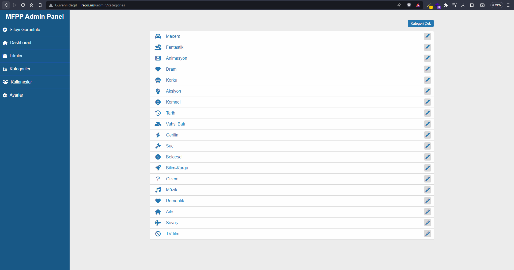
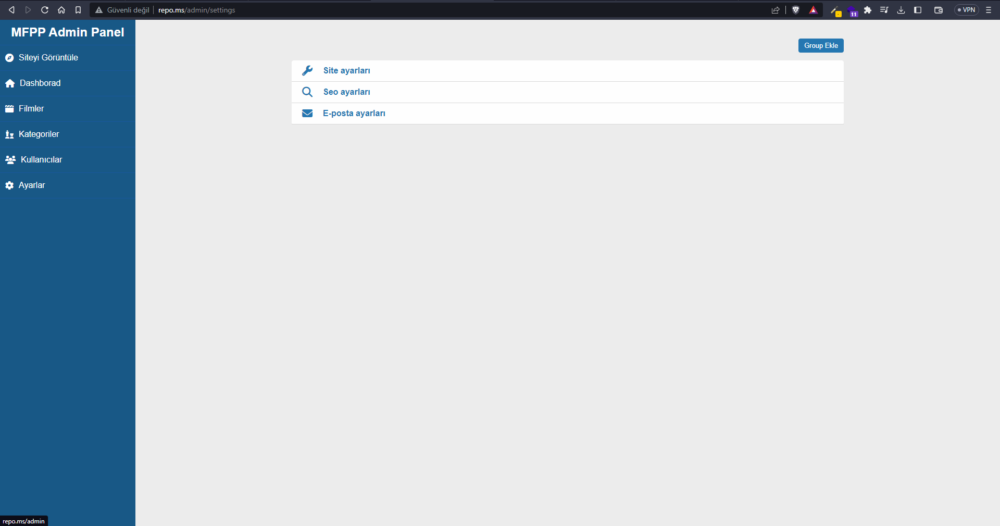
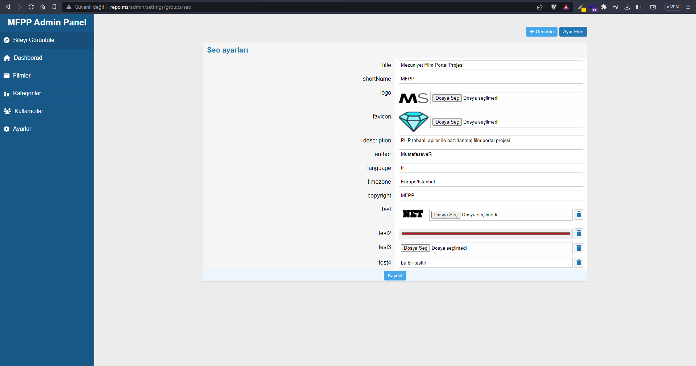
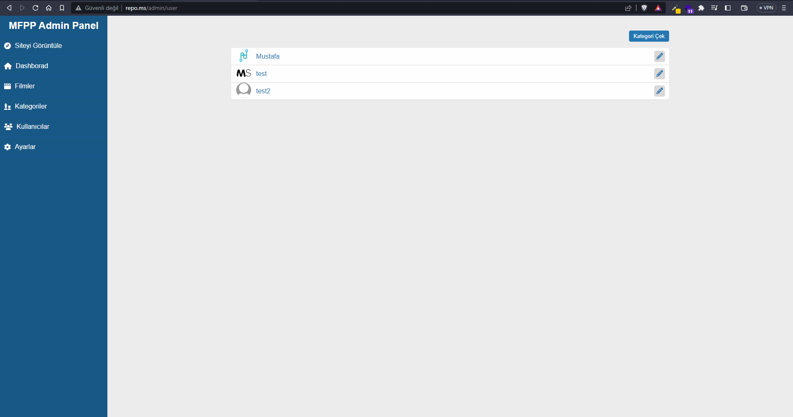
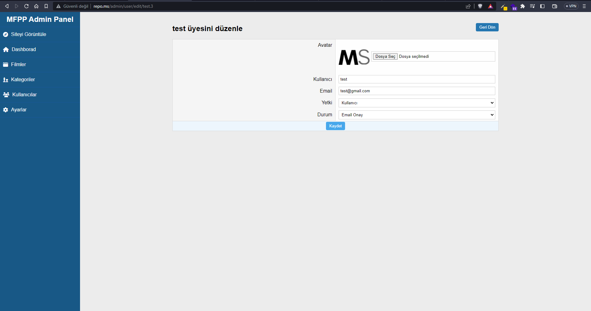
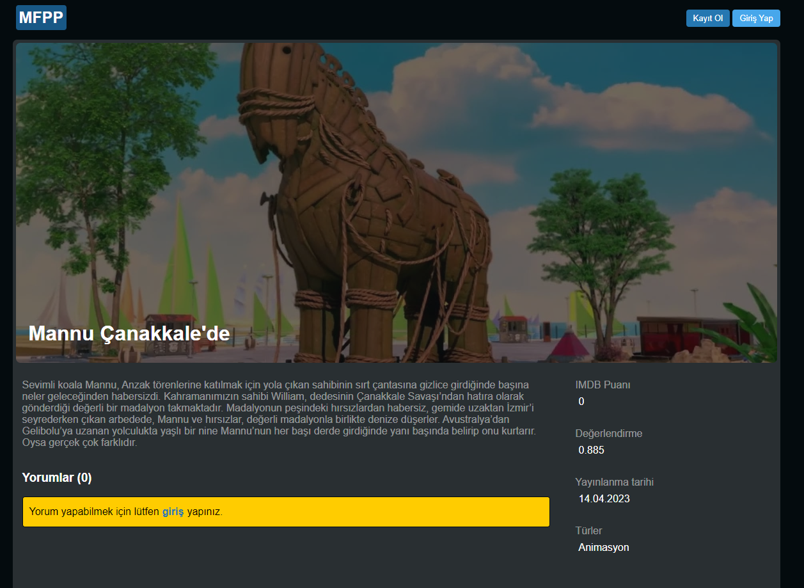
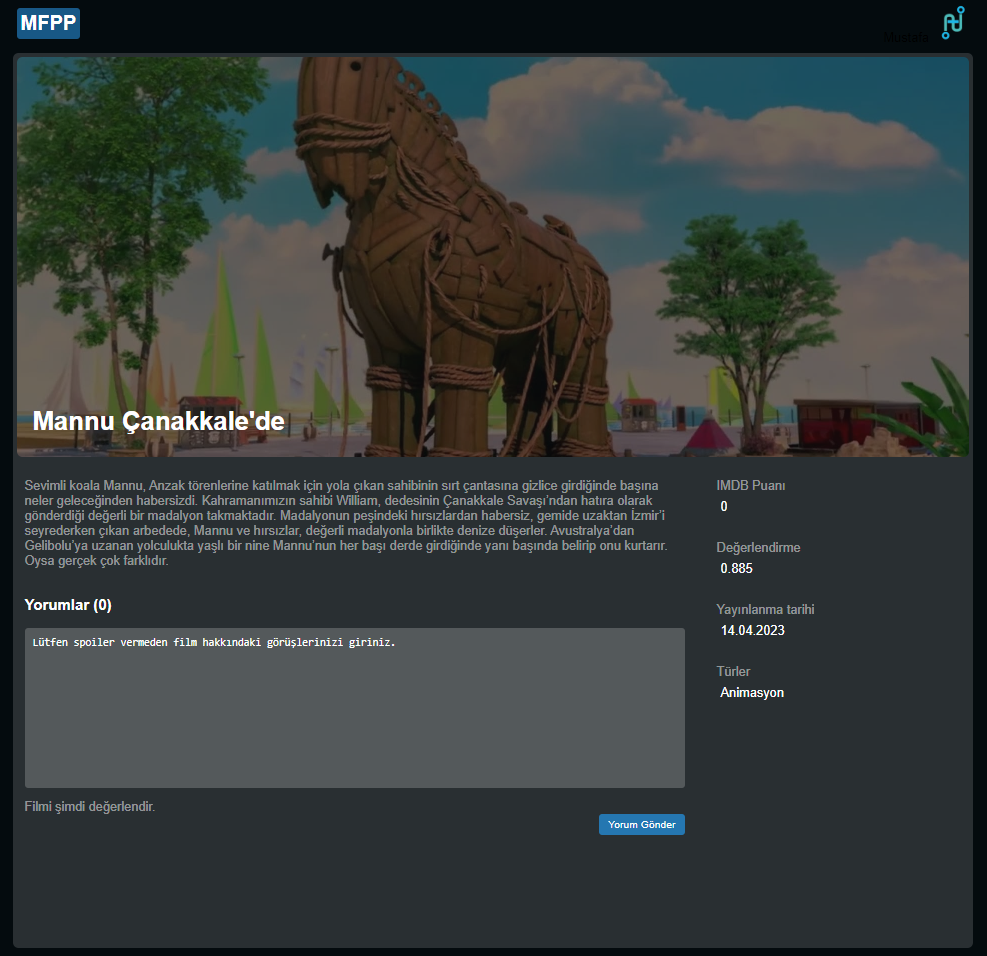
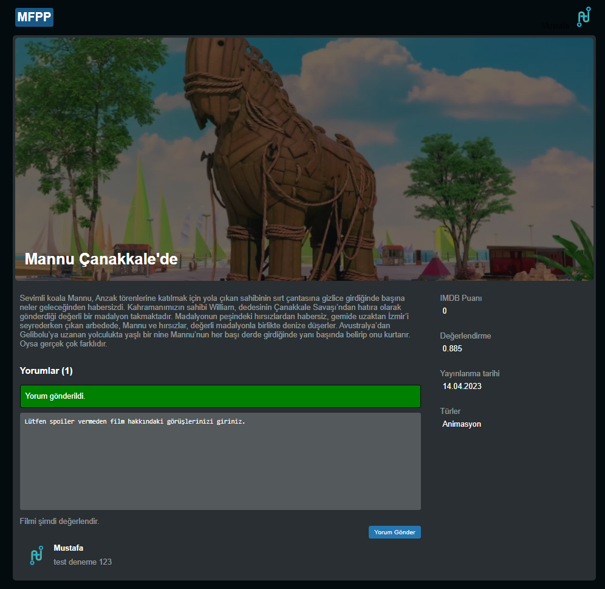
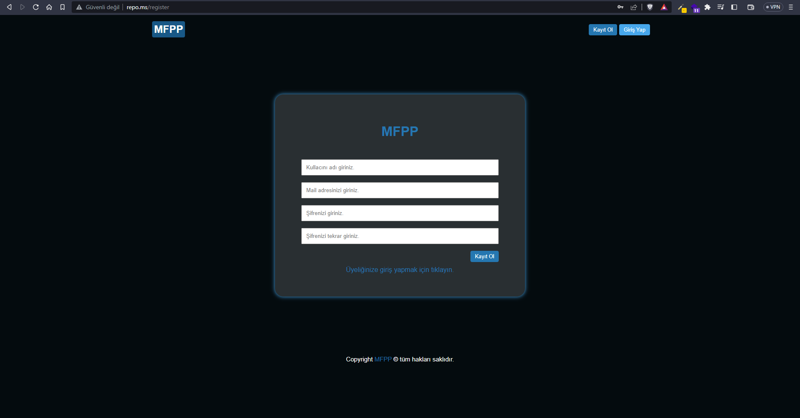
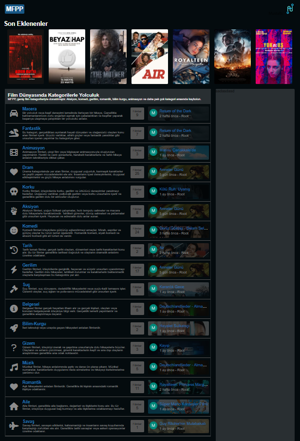

#### V:1.0.6 Geliştirmeler
- Settings kısmında logo favicon veya kendi oluşturmuş olduğumuz bir dosya yüklemek ve silmek için image işlemleri yapıldı.
- Settings kısmında resim kaydederken her kategori için ayrı resim klasörü oluşturacak şekilde düzenlendi 
- Image upload ve delete OOP yapısına dönüştürmek için ImageController sınıfı oluşturdum.
- Settings kısmında yaptığım resim yükleme işlemlerini ImageController sınıfını kullanarak düzenledim.

- Layout üzerinde (title,favicon,keyword,author) gibi meta etiketleri eklendi.
- Tarih (Zaman) işlemleri için Carbon paketini projeye dahil ettim.
- Yorum Modelini (FilmComment) Film sınıfı ile bağladım.
- Yorum gönderme ve yorum sayısı film detay sayfasına ekledım.

- Alert sistemi yazıldı ve gerekli alanlara eklendi.
- Lang dosyası dahil edildi ve gerekli türkçeleştirme dosyaları yüklendi.
- Film detay sayfasına alertler ekledim. 

- Admin panel kullancılar ekledim.
- Kullanıcı kayıt sırasında token oluşturma işlemi ekledim.
- Film yorum yapılırken token üzerinden işlem yapılmasını sağladım.
- Kullancılar düzenleme silme işlemlerini ayarladım.
- Admin sidebar kullancılar ekledim.

- Kategori sayfasını düzenledim ve tasarıma uyarladım.
- Ayar ekleme sayfasını düzenledim ve tasarıma uyarladım.
- Login ve Register sayfasını düzenledim ve tasarıma uyarladım.
- Footer alanında copyright text eklendi.

###### 1.0.6 Sürümden Kareler

