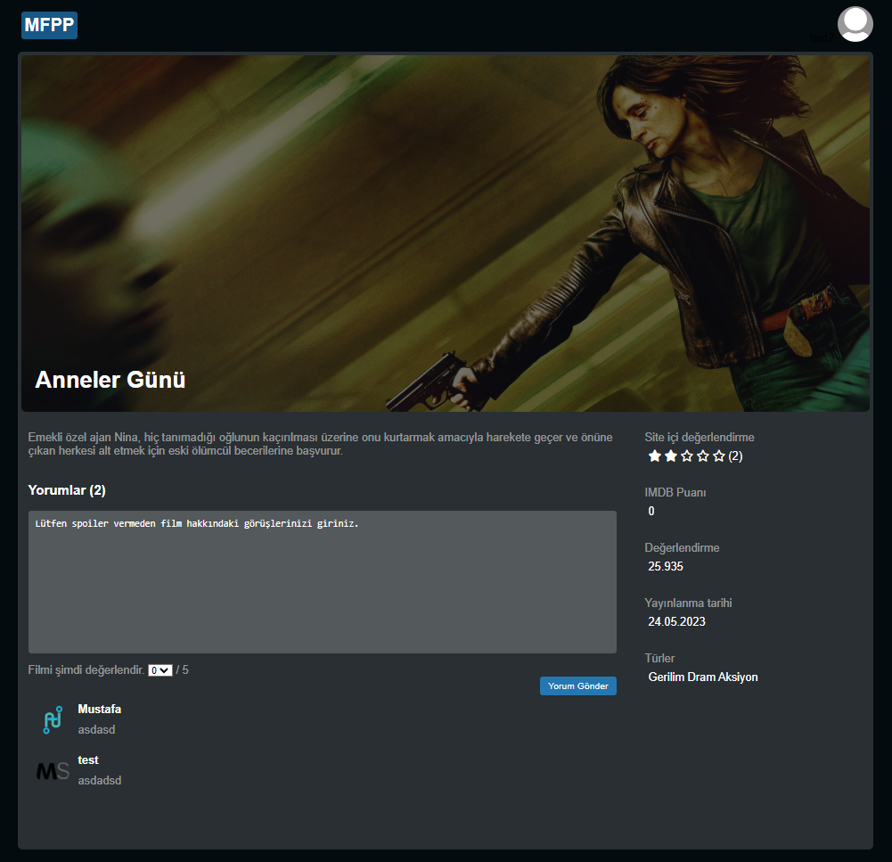
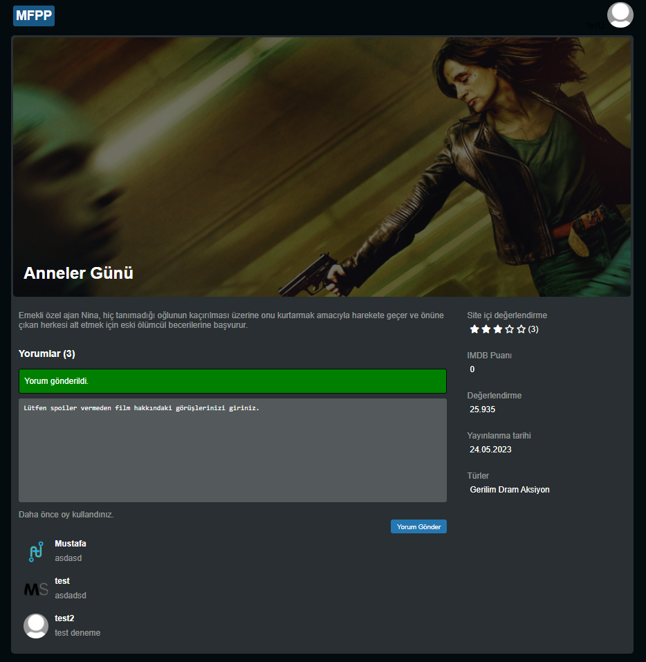
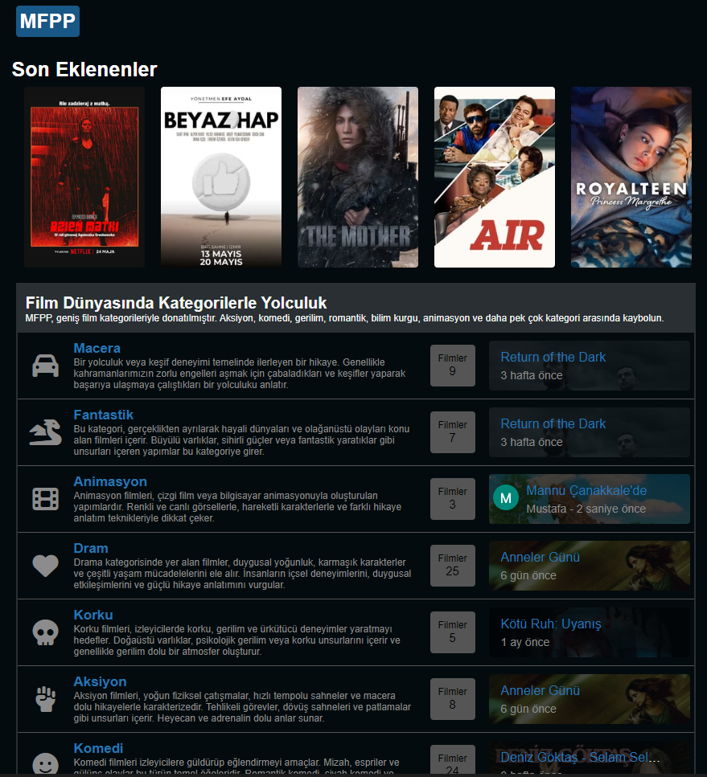
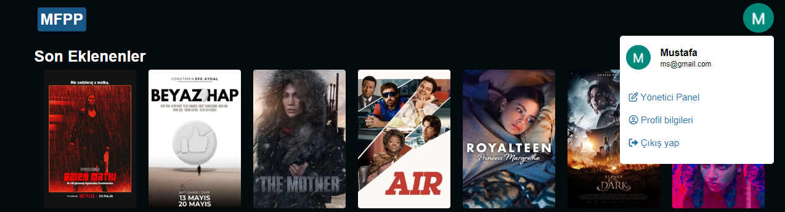
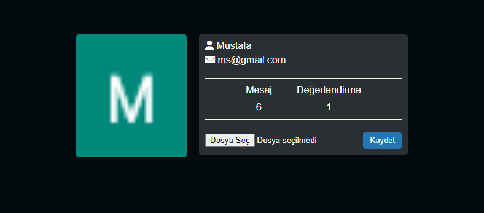

#### V:1.0.7 Geliştirmeler
- FilmVote model ve migration oluşturdum.
- FilmVote mysql tablosunu aktif ettim.
- Film detay sayfasında kullanıcıların film değerlendirme ve puanlaması için bir alan oluşturdum.
- Film detay sayfasına kullanılan oy ve kullanıclar sayısını ekledim.

- Kullanıcılar için başlangıç kayıt için default avatar ayarladım.
- Film ve FilmComment modellerinde birleştirme işlemleri yaptım.
- İndex Controllerda film'ler ile ilgi daha fazla sorgu yazdım en son yorum yapan id ve user tablosu ile birleştirilmesi.
- Userbox adı altında yeni bir scss dosyası oluşturup navbarda için özel bir dropdown menü yazdım.
- Home blade userbox kullandım.
- userbox içinde admin panel çıkış yap gibi ayarları sağladım.
- Anasayfada son yorum yapanların avatar ve ismini çektim.
- Profil sayfası oluşturdum
- Profil sayfasına mesaj sayısı ve değerlendirme sayısını ekledim.
- Profil sayfasına profil resmi güncellemek için alan ekledim.

###### 1.0.7 Sürümden Kareler

