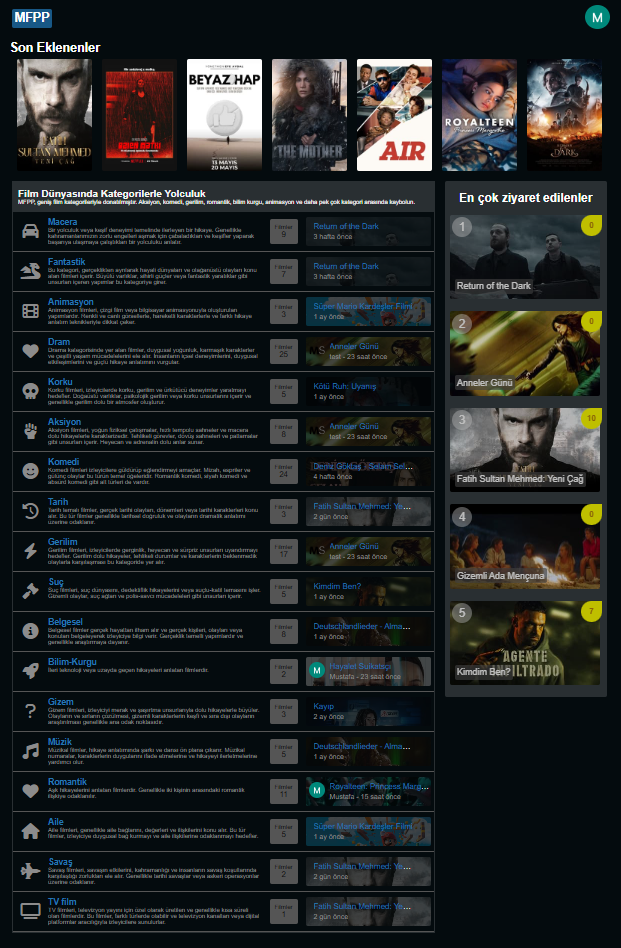
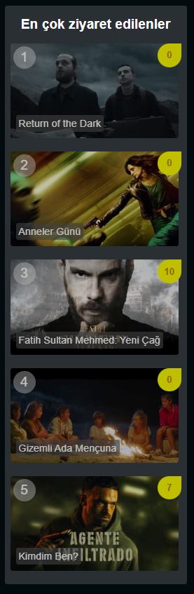

## EXTRA Geliştirmeler

#### V:1.0.8 Geliştirmeler
- FilmVisitors migration'unu oluşturudum ve gerekleyi ayarlamaları yaptım.
- FilmVisitors Model sınıfı oluşturdum ve film modeli ile bağladım.
- FilmVisitors middleware oluşturdum ve route ekledim her film sayfasına girildiğinde mysql ekleme yapacak.
- 
- Sidebar alanı oluşturdum.
- Sidebar alanı için en çok ziyaret eden filmleri çektim.
- Sidebar alanı için main.scss içinde gerekli stil tanımlamalarını yaptım.
- Sidebar'ı components olarak tekrar oluşturdum ve ilgili sayfalara çektim.

###### 1.0.8 Sürümden Kareler

